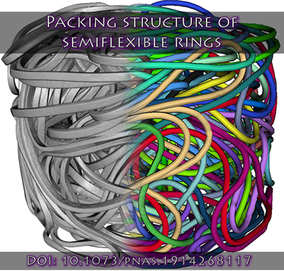

# Data of "Packing structure of semiflexible rings"



This repository contains the data associated with the manuscript: [**"Packing structure of semiflexible rings"**](https://www.pnas.org/cgi/doi/10.1073/pnas.1914268117), *L. R. Gómez, N. A. García and T. Pöschel*, PNAS (2020). DOI: [10.1073/pnas.1914268117](https://www.pnas.org/cgi/doi/10.1073/pnas.1914268117)

## Data details

* **Folder UVFs:** Contains the reconstructed tomographies for all systems. Initially, the data was acquired as REK file (Fraunhofer EZRT Volume Data). But to share on this repository, we converted to UVF (Unified Volume Format) to save space. These files can be visualized using [ImageVis3D](http://www.sci.utah.edu/software/imagevis3d.html).

* **Folder VTKs:** Contains the segmented rings for each system studied in the paper. To visualize, we recommend using [VisIt](https://wci.llnl.gov/simulation/computer-codes/visit/) and plot the files as *Molecule*.

* **Folder PLTs:** Again the segmented rings but here represented as tubes. The format is called *TECPLOT* and also to render, we recommend [VisIt](https://wci.llnl.gov/simulation/computer-codes/visit/) (plot as *Pseudocolor*) or [Paraview](https://www.paraview.org).

## Contact
If you have questions or comments, please contact Leopoldo R. Gómez at lgomez(at)uns.edu.ar or Nicolás A. García at garciana(at)ill.fr.

## Citation
```
@article {Gomez2020,
	author = {G{\'o}mez, Leopoldo R. and Garc{\'\i}a, Nicol{\'a}s A. and P{\"o}schel, Thorsten},
	title = {Packing structure of semiflexible rings},
	elocation-id = {201914268},
	year = {2020},
	doi = {10.1073/pnas.1914268117},
	publisher = {National Academy of Sciences},
	issn = {0027-8424},
	URL = {https://www.pnas.org/content/early/2020/02/04/1914268117},
	eprint = {https://www.pnas.org/content/early/2020/02/04/1914268117.full.pdf},
	journal = {Proceedings of the National Academy of Sciences}
}
```